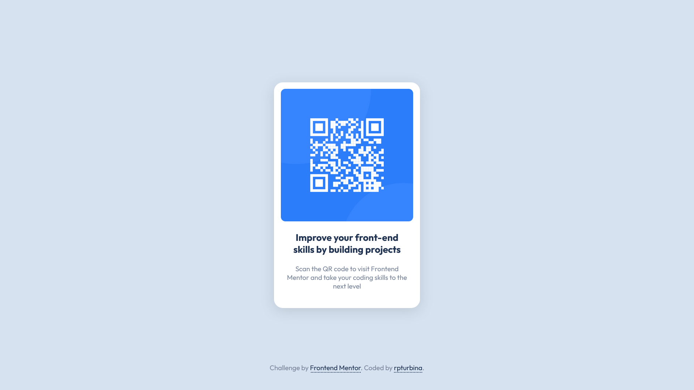

# Frontend Mentor - QR code component solution

This is a solution to the [QR code component challenge on Frontend Mentor](https://www.frontendmentor.io/challenges/qr-code-component-iux_sIO_H). Frontend Mentor challenges help you improve your coding skills by building realistic projects.

## Table of contents

- [Overview](#overview)
  - [Screenshot](#screenshot)
  - [Links](#links)
- [My process](#my-process)
  - [Built with](#built-with)
- [Author](#author)
- [Acknowledgments](#acknowledgments)

## Overview

### Screenshot

### Links

- Solution URL: [github.com/rpturbina/qr-code-component-main](https://github.com/rpturbina/qr-code-component-main)
- Live Site URL: [rpturbina.github.io/qr-code-component-main](https://rpturbina.github.io/qr-code-component-main/)

## My process

### Built with

- Semantic HTML5 markup
- CSS custom properties
- Flexbox
- Mobile-first workflow
- BEM CSS Methodology

## Author

- Website - [Rizki Pratama Turbina](https://rpturbina.github.io)
- Frontend Mentor - [@rpturbina](https://www.frontendmentor.io/profile/yourusername)
